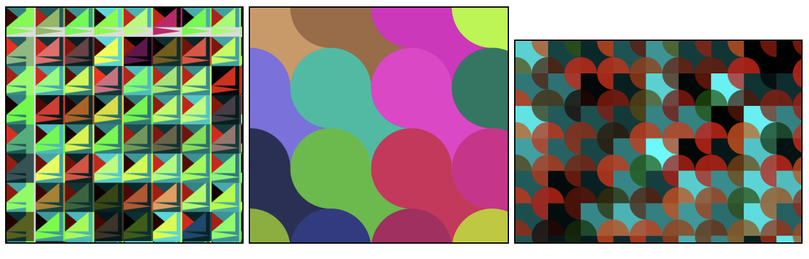

# Wallpaper Design Project
You recently have been hired by Apple’s design team to create a new wallpaper for their new line laptops. In order to boost sales and reach out to different audiences, Apple would like these wallpapers to have some different color themes and use repetition. Be as creative and original as possible!

## Requirements
1. The program should include at least two for loops.
2. The for loop(s) should be used to increment values such as width, height, or color.
3. Variations should result from changing different values in the loop. The designs should not only vary in color. Play with size, number of repetitions etc.
4. Save three different variations of the same design
5. **STRETCH**: Randomize your wallpaper! Use the random function to generate variations of your wallpaper. It should randomize the size or color of the shapes while keeping the same design in place.

